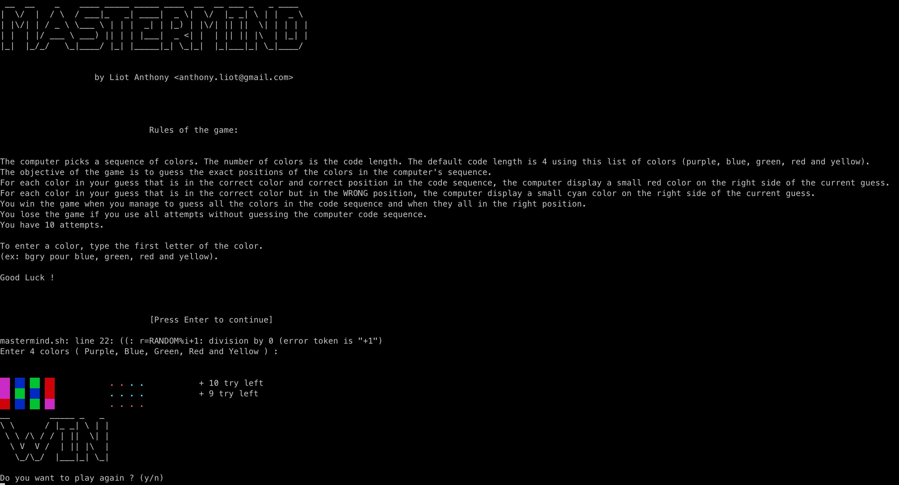

<h1 align="center"><a href="https://github.com/anthonyliot/mastermind/releases/tag/v1.0">MASTERMIND</a></h1>

<strong>Mastermind game in shell</strong>
 2006

 
<h2>About</h2>
This project was developed during my bachelor degree in Caen, France.
 
...
 
You can download the Shell file and try it <a href="https://github.com/anthonyliot/masterming/releases/tag/v1.0">here</a>

<h2>Installation</h2>

1. Download this project
2. Just run 'bash mastermind.sh'

<h2>Copyright</h2>
This project is licensed under the terms of the MIT license. See <a href="LICENSE">license</a>.